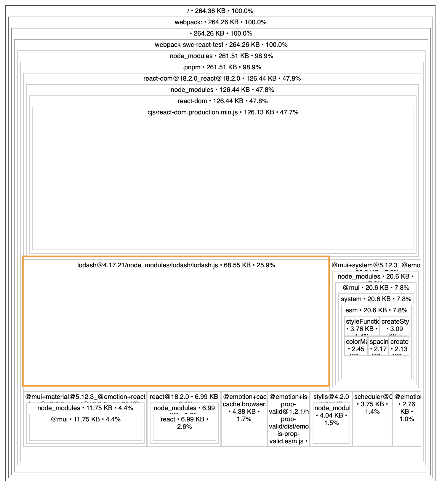
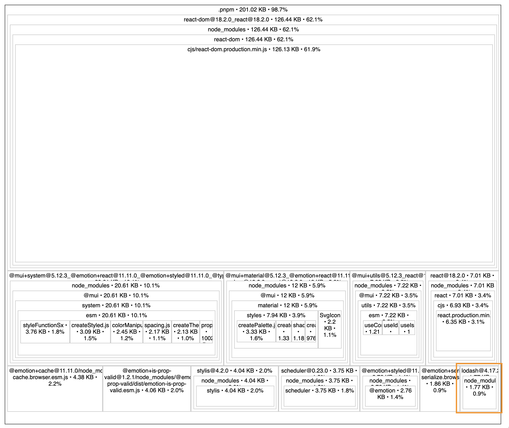
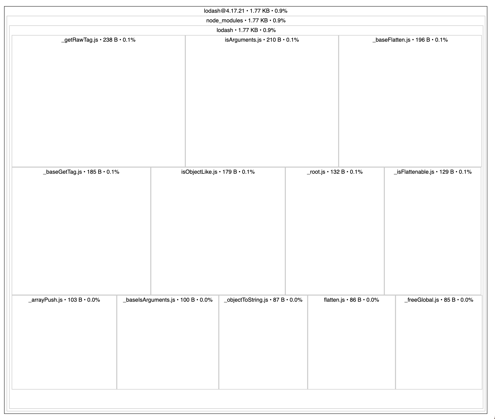
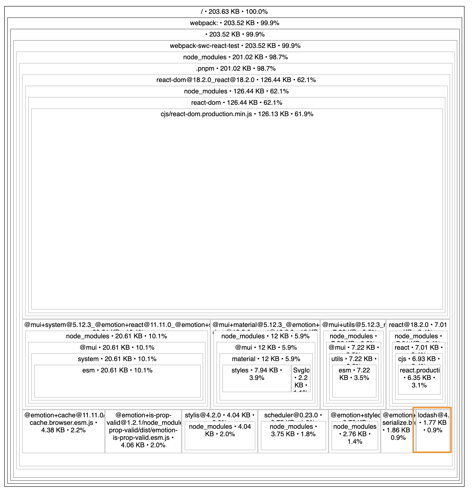

# Testing `@swc/plugin-transform-imports` in a React SPA bundled by webpack

## named imports

```js
// App.tsx

import { DirectionsRun } from '@mui/icons-material';
import { flatten } from 'lodash';
```



## default imports

```js
// App.tsx
import DirectionsRun from '@mui/icons-material/DirectionsRun';
import flatten from 'lodash/flatten';
```



Lodash drops from 68.55KB to 1.77KB



## named imports with [@swc/plugin-transform-imports](https://github.com/swc-project/plugins/tree/main/packages/transform-imports)

```js
// App.tsx
import { DirectionsRun } from '@mui/icons-material';
import { flatten } from 'lodash';
```


